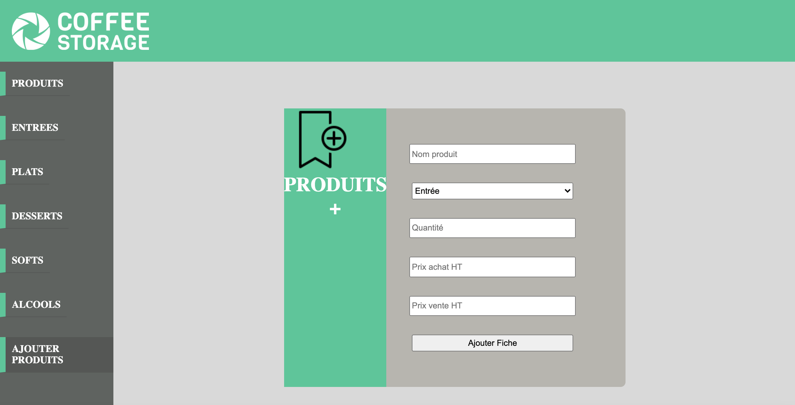
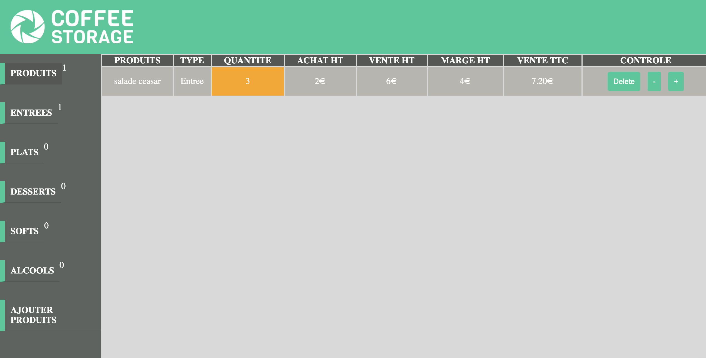

<ul> Coffee storage est une application en Javascript permettant la gestion d'un stock, 
  les fonctionnalités sont les suivantes : 
  <li>L'ajout de produit avec le nom du produit, le type, la quantité, le prix HT & le prix de vente HT. </li>
  <li>Le calcul du prix TTC est ici automatisé </li>
  <li>Le produit s'affiche dans l'onglet Produits et se trouvera également dans l'onglet correspondant à son type (entrée, plats,..)</li>
  <li>La modification du produit une fois créé, le nom, le type, le prix HT, le prix de vente HT, la quantité et la possibilité de supprimer le produit </li>
  <ul>

# Coffe_storage
<h1>Interface d'ajout de stock</h2>

<h1>interface de gestion de stock</h2>

